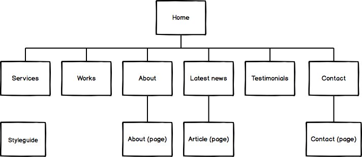

# 0x00. Advanced HTML

## HTML
## Front-end

## Concepts
For this project, we expect you to look at this concept:

- [HTML - elements of a web page]()

## Welcome!
Welcome to the Web Stack specialization. The first three projects will give you all the basics of Web development: HTML, CSS, and Developer tools.

In this project, you will learn how to use HTML tags to structure a web page. No CSS, no styling - don’t worry, the final page will be “ugly”; it’s normal, and it’s not the purpose of this project.

**Important note:** details are important! Lowercase vs uppercase / wrong letter… be careful!

## Resources
Read or watch:

- [HTML 5.2](https://www.w3.org/TR/html52/)
- [HTML: HyperText Markup Language | MDN](https://developer.mozilla.org/en-US/docs/Web/HTML)
- [HTML Reference - A free guide to all HTML elements and attributes](https://htmlreference.io/)
- [Can I use… Support tables for HTML5, CSS3, etc](https://caniuse.com/)
- [HTML Cheat Sheet - WebsiteSetup](https://websitesetup.org/html5-cheat-sheet/)

## Learning Objectives
At the end of this project, you are expected to be able to explain to anyone, without the help of Google:

- Which guidelines to follow for HTML
- How to create the skeleton of an HTML5 page
- How to use semantic HTML tags to structure a web page
- Which use cases to use div vs span
- The semantic values of header, main, footer, article, nav, section, aside
- How to use headings (and why it’s important to follow the hierarchical order)
- How to make lists in HTML
- The differences between medias (SVG, GIF, PNG, JPG)
- How to structure data in a table
- How to integrate a video on a webpage
- How to integrate an audio file on a webpage
- How to embed external content
- How to correctly structure an HTML page

## Requirements
- A README.md file at the root of the folder of the project is mandatory
- Your code should be W3C compliant and validate with W3C-Validator
- Techium will be the name of the company we will use across our webpages.

## Sitemap of the project

## Wireframe of Techium project

  
Show/Hide Quiz

## Quiz questions
  
### Question #0
Which information can we find in the `<head>` tag? Please select all correct answers

- [x] link to stylesheets
- [x] metadata
- [ ] link to Twitter
- [ ] navigation

### Question #1
Which tag should we use to embed another website?

- [ ] `<code>`
- [ ] `
`
- [ ] `<a>`
- [ ] `
`
- [x] `<iframe>`

### Question #2
Which tag should we use to change the font weight of a text? Please select all correct answers

- [x] `<strong>`
- [ ] `<em>`
- [x] `<b>`
- [ ] `<h1>`
- [ ] `<i>`
- [ ] `<bold>`

### Question #3
Which tag should we use to group elements in an unordered list?

- [ ] `<unordered list>`
- [ ] `<table>`
- [x] `<ul>`
- [ ] `<li>`
- [ ] `<ol>`
- [ ] `<list>`

### Question #4
Which tag should we use to draw a horizontal line? (usually used to separate topics in a paragraph)

- [x] `
`
- [ ] `<line>`
- [ ] `<break>`
- [ ] ` `

### Question #5
How many levels are available in HTML5 for section headings?

- [ ] 8
- [x] 6
- [ ] 2
- [ ] 1
- [ ] 4
- [ ] 10

### Question #6
Which tag should we use to create a hyperlink?

- [x] `<a>`
- [ ] `
`
- [ ] `<to>`
- [ ] `<link>`
- [ ] `
`

### Question #7
Which tag should we use to change the browser tab text?

- [ ] `<browser>`
- [ ] `<head>`
- [ ] `<tab>`
- [x] `<title>`

### Question #8
Which tag should we use to embed an image?

- [ ] `<caption>`
- [x] ``
- [ ] `
`
- [ ] `<iframe>`

### Task 0: Create your first webpage

Create your first HTML file `0-index.html `with:

- Add the doctype on the first line (without any comment)
- Open and close an HTML tag after the doctype
- Add the language tag, specify English for the ISO language code, and add the direction tag (ltr or rtl) on the HTML tag.
- Open your file in your browser (the page should be blank)
- Ignore W3C errors

**Repo:**
-  GitHub repository: `alx-frontend`
-  Directory: `0x00-html_advanced`
-  File:  `0-index.html`

---

### Task 1: Structure your webpage

Copy the content of `0-index.html` into `1-index.html`
- Create the head and body sections inside the HTML tag
- The head and body tags should be empty
- Ignore W3C errors

**Repo:**
- GitHub repository: `alx-frontend`
- Directory: `0x00-html_advanced`
- File:  `1-index.html`

---

### Task 2: The head - meta charset, viewport, title, description, favicons

Copy the content of `1-index.html` into `2-index.html`

**Meta charset:**
  - Add a meta tag inside the head.
  - Add the `charset` attribute with the value `utf-8`.

**Viewport:**
  - Add a meta tag inside the head.
  - Add an attribute `name` on the tag and specify that it is the meta viewport.
  - Add the key `width` with the value `device-width`.
  - Add the key `initial-scale` with the value `1.0`.
  - Add the key `viewport-fit` with the value `cover`.

**Title:**
  - Add the title tag just after the meta viewport with the value: "`Homepage - Techium"`.

**Description:**
  - Add a meta tag inside the head section.
  - Add an attribute `name` on the tag and specify that is the meta description.
  - Add another attribute called `content`.
  - Add the following description: "`Techium is a digital agency"`.

**Favicons:**
  - Download the image above to use as a favicon.
  - Use the tool at https://realfavicongenerator.net/ to generate all the favicon formats.
  - Take the `favicon.ico` and `favicon.png` and place these at the root of your project directory, so that it is siblings with your `[0-9]+-index.html` files.
  - Inside the head, create 2 link tags with these 3 attributes: `rel`, `type`, and `href`.
    - The first link tag:
      - `rel`: icon
      - `type`: image/x-icon
      - `href`: `./favicon.ico`
    - The second link tag:
      - `rel`: icon
      - `type`: image/png
      - `href`: `./favicon.png`

**Repo:**
-  GitHub repository: `alx-frontend`
-  Directory: `0x00-html_advanced`
-  File:  `2-index.html`

---

### Task 3: Simple header, main, footer

Copy the content of `2-index.html` into `3-index.html`

**Header:**
  - Create the header of your page between the open and close body tags.
  - Put the text "`Header"` inside the header.

**Main:**
  - Create the main tag after the header tag.
  - Put the text "`Main content"` inside your main tags.

**Footer:**
  - Create the footer tag after the main tag.
  - Put the text "`Footer"` inside the footer tags.

**Repo:**
- GitHub repository: `alx-frontend`
- Directory: `0x00-html_advanced`
- File: `3-index.html`

---

### Task 4: Aside

Copy the contents of `3-index.html` into `article.html`
- Change the `<title>` to put: "`Article - Techium"`
  - Inside the main tags after the text, create the aside tags with text "`Aside"`

**Repo:**
- GitHub repository: `alx-frontend`
- Directory: `0x00-html_advanced`
- File: `article.html`

---

### Task 5: Section

Copy the content of `3-index.html` into `5-index.html`
- Inside your `<main>` section:
  - Remove the text in main.
  - Create these sections:
    - Create the first section and put the text "`Hero section"` inside.
    - Create the second section and put the text "`Services section"` inside.
    - Create the third section and put the text "`Works section"` inside.
    - Create the fourth section and put the text "`About section"` inside.
    - Create the fifth section and put the text "`Latest news section"` inside.
    - Create the sixth section and put the text "`Testimonials section"` inside.
    - Create the seventh section and put the text "`Contact section"` inside.
Ignore W3C errors

**Repo:**
- GitHub repository: `alx-frontend`
- Directory: `0x00-html_advanced`
- File: `5-index.html`

---

### Task 6: Work, News, Testimonial articles

Copy the content of `5-index.html` into `6-index.html`

**Work articles:**
  - Inside the section "`Works section"`, add 3 article tags.
  - add 3 article tags
    - Inside each article, write "`Work #"` where the hashtag will be the ordered number (1, 2, or 3).

**News articles:**
  - Inside the section "`Latest news section"`, add 3 article tags.
  - add 3 article tags
    - Inside each article, write "`Article #"` where the hashtag will be the ordered number (1, 2, or 3).

**Testimonial articles:**
  - Inside the section "`Testimonials section"`, add 3 article tags.
  - add 3 article tags
  - Inside each article, write "`Testimonial #"` where the hashtag will be the ordered number (1, 2, or 3).
Ignore W3C errors

**Repo:**
- GitHub repository: `alx-frontend`
- Directory: `0x00-html_advanced`
- File: `6-index.html`

---

### Task 7: Navigation

Copy the content of `6-index.html` into `7-index.html`
- Remove the "`Header"` text inside the `<header>`
- Create the `nav` tag inside the `header` tag.
- The `nav` tag should remain empty for now.
- Ignore W3C errors

**Repo:**
- GitHub repository: `alx-frontend`
- Directory: `0x00-html_advanced`
- File: `7-index.html`

---

### Task 8: Level 1 headings

Copy the content of `7-index.html` into `8-index.html`
- Create the level 1 heading inside your main before your sections.
- Put text "`Homepage"` in your heading tag.
- Ignore W3C errors

**Repo:**
- GitHub repository: `alx-frontend`
- Directory: `0x00-html_advanced`
- File: `8-index.html`

---

### Task 9: Level 2 headings

Copy the content of `8-index.html` into `9-index.html`
- In the section tag with the text "`Hero section,"` remove the text and create a level 2 heading with text "`We help you build your brand!"`
- In the section tag with the text "`Services section,"` remove the text and create a level 2 heading with text "`Services."`
- In the section tag with the text "`Works section,"` remove the text and create a level 2 heading with text "`Works."`
- In the section tag with the text "`About section,"` remove the text and create a level 2 heading with text "`About Us."`
- In the section tag with the text "`Latest news section,"` remove the text and create a level 2 heading with text "`Latest news."`
- In the section tag with the text "`Testimonials section,"` remove the text and create a level 2 heading with text "`Testimonials."`
- In the section tag with the text "`Contact section,"` remove the text and create a level 2 heading with text "`Contact."`
- Ignore W3C errors

**Repo:**
- GitHub repository: `alx-frontend`
- Directory: `0x00-html_advanced`
- File: `9-index.html`

---

### Task 10: Level 3 headings
Copy the content of `9-index.html `into `10-index.html`

#### Services headings:

- Inside the section containing the h2 heading "`Services,"` add these elements right after the h2:
  - Create a level 3 heading with text "`Design & Concept."`
  - Create a level 3 heading with text "`Digital Strategy."`
  - Create a level 3 heading with text "`Content Strategy."`
  - Create a level 3 heading with text "`UX Design."`
  - Create a level 3 heading with text "`Web Development."`
  - Create a level 3 heading with text "`Social Media."`

#### Works headings:

- Inside the section containing the h2 heading "`Works:"`
  - In the first article, replace the text with a level 3 heading with text "`Interior Design."`
  - In the second article, replace the text with a level 3 heading with text "`Web Development."`
  - In the third article, replace the text with a level 3 heading with text "`Personal Brand."`

#### About Us headings:

- Inside the section containing the h2 heading "`About Us,"` after the h2 heading, create these elements in this order:
  - Create a level 3 heading with text "`Who are we."`
  - Create a level 3 heading with text "`Our culture."`
  - Create a level 3 heading with text "`How we work."`

#### Latest news headings:

- Inside the section containing the h2 heading "`Latest news:"`
  - In the first article, replace the text with a level 3 heading with text "`Hoc loco tenere se Triarius non potuit."`
  - In the second article, replace the text with a level 3 heading with text "`Ut alios omittam, hunc appello, quem ille unum secutus est."`
  - In the third article, replace the text with a level 3 heading with text "`Bestiarum vero nullum iudicium puto."`
- Ignore W3C errors

**Repo:**
- GitHub repository: `alx-frontend`
- Directory: `0x00-html_advanced`
- File: `10-index.html`

---

### Task 11: Styleguide

Copy the content of `3-index.html` into `11-styleguide.html`
- Change the title to "`Styleguide - Techium"`
- Remove the text from header, main, and footer
- Create a new `<section>` inside your main tag
- Create a header in this section
- In the header, add a level 2 heading with text "`Headings"`
- After the header:
  - Add a level 1 heading with text "`Heading level 1"`
  - Add a level 2 heading with text "`Heading level 2"`
  - Add a level 3 heading with text "`Heading level 3"`
  - Add a level 4 heading with text "`Heading level 4"`
  - Add a level 5 heading with text "`Heading level 5"`
  - Add a level 6 heading with text "`Heading level 6"`

**Repo:**
- GitHub repository: `alx-frontend`
- Directory: `0x00-html_advanced`
- File: `11-styleguide.html`

---

### Task 12: Paragraphs

Copy the content of  `10-index.html` into `12-index.html`

#### About Us paragraphs:

- In the About Us section:
  - After the first h3 ("`Who are we"`), create a paragraph with the text: "`Lorem ipsum dolor sit amet, consectetur adipisicing elit. Ipsum, omnis expedita! Eum, praesentium cumque accusantium rem, sit quaerat est nisi ratione, deserunt ducimus quidem iste dicta quibusdam atque maxime cum!"`
  - After the second h3, create a paragraph with the text: "`Lorem ipsum dolor sit amet, consectetur adipisicing elit. Ipsum, omnis expedita! Eum, praesentium cumque accusantium rem, sit quaerat est nisi ratione, deserunt ducimus quidem iste dicta quibusdam atque maxime cum!"`
  - After the third h3, create a paragraph with the text: "`Lorem ipsum dolor sit amet, consectetur adipisicing elit. Ipsum, omnis expedita! Eum, praesentium cumque accusantium rem, sit quaerat est nisi ratione, deserunt ducimus quidem iste dicta quibusdam atque maxime cum!"`

#### Latest news paragraphs:

- In the Latest news section:
  - In the first article:
    - Create a paragraph with text "`Career"` before the heading.
    - Create a paragraph with text "`Lorem ipsum dolor sit amet, consectetur adipiscing elit. Id Sextilius factum negabat. Quo tandem modo? At eum nihili facit; Quae contraria sunt his, malane?"` after the heading.
  - In the second article:
    - Create a paragraph with text "`Digital Life"` before the heading.
    - Create a paragraph with text "`Lorem ipsum dolor sit amet, consectetur adipiscing elit. Tum mihi Piso: Quid ergo? Tum ille: Ain tandem? Non autem hoc: igitur ne illud quidem. Sed quod proximum fuit non vidit. Nos commodius agimus. An nisi populari fama?"` after the heading.
  - In the third article:
    - Create a paragraph with text "`Social"` before the heading.
    - Create a paragraph with text "`Lorem ipsum dolor sit amet, consectetur adipiscing elit. Non igitur bene. Quid enim est a Chrysippo praetermissum in Stoicis? Pugnant Stoici cum Peripateticis. Prioris generis est docilitas, memoria; Apparet statim, quae sint officia, quae actiones."` after the heading.

#### Contact paragraph:

- In the Contact section after the heading:
  - Create a paragraph with the text: "`Lorem ipsum dolor sit amet, consectetur adipiscing elit. Id Sextilius factum negabat. Quo tandem modo? At eum nihili facit; Quae contraria sunt his, malane?"`

#### Additional paragraphs:

- Below the level 2 Services heading, add a paragraph with text "`We work with you."`
- Below the level 2 Works heading, add a paragraph with text "`Take a look at our portfolio."`
- Below the level 2 About Us heading, add a paragraph with text "`Everything about us."`
- Below the level 2 Testimonials heading, add a paragraph with text "`We are more than a digital company."`
- Below the level 2 Contact heading, add a paragraph with text "`We like to know new people."`
- Ignore W3C errors

**Repo:**
- GitHub repository: `alx-frontend`
- Directory: `0x00-html_advanced`
- File: `12-index.html`

---

### Task 13: Styleguide Paragraphs

Copy the contents of `11-styleguide.html` into `13-styleguide.html`
- After the existing section containing Headings, create a new section in the main.
- In this section, create a header.
- Inside the header, create a level 2 heading with text "`Paragraph."`
- After the header:
  - Add a level 2 heading with text "`Heading with a subtitle."`
  - Add a paragraph with text "`This is my subtitle."`
  - Add another paragraph with text: "`Nunc lacinia ante nunc ac lobortis. Interdum adipiscing gravida odio porttitor sem non mi integer non faucibus ornare mi ut ante amet placerat aliquet. Volutpat eu sed ante lacinia sapien lorem accumsan varius montes viverra nibh in adipiscing blandit tempus accumsan."`

**Repo:**
- GitHub repository: `alx-frontend`
- Directory: `0x00-html_advanced`
- File: `13-styleguide.html`

---

### Task 14: Span

Copy the contents of `12-index.html` into `14-index.html`
- In the very first `<header>`, before the `nav`, create a span with the text "`Techium."`
- Ignore W3C errors

**Repo:**
- GitHub repository: `alx-frontend`
- Directory: `0x00-html_advanced`
- File: `14-index.html`

---

### Task 15: Div

Copy the contents of `14-index.html` into `15-index.html`
- Wrap the contents of the `header` element with a `div`
- Wrap the contents of all `section` elements with a `div`
- Finally, wrap the contents of the `<footer>` tag with a `div`
- W3C does not need to pass

**Repo:**
- GitHub repository: `alx-frontend`
- Directory: `0x00-html_advanced`
- File: `15-index.html`

---

### Task 16: Structure your Sections

Copy the contents of `15-index.html` into `16-index.html`
- In the `div` in the Services section:
  - Create a `header` tag that wraps the `h2` and the `p`
  - Create a `div` sibling to the `header` that wraps the rest of the content
- In the `div` in the Works section:
  - Create a `header` tag that wraps the `h2` and the `p`
  - Create a `div` sibling to the `header` that wraps the rest of the content
- In the `div` in the About Us section:
  - Create a `header` tag that wraps the `h2` and the `p`
  - Create a `div` sibling to the `header` that wraps the rest of the content
- In the `div` in the Latest news section:
  - Create a `header` tag that wraps the `h2`
  - Create a `div` sibling to the `header` that wraps the rest of the content
- In the `div` in the Testimonials section:
  - Create a `header` tag that wraps the `h2` and the `p`
  - Create a `div` sibling to the `header` that wraps the rest of the content
- In the `div` in the Contact section:
  - Create a `header` tag that wraps the `h2` and the first `p`
  - Create a `div` sibling to the `header` that wraps the rest of the content
- W3C does not need to pass

**Repo:**
- GitHub repository: `alx-frontend`
- Directory: `0x00-html_advanced`
- File: `16-index.html`

---

### Task 17: Comments

Copy the contents of `16-index.html` into `17-index.html`
- Before the `header`, add a line break and a comment saying "`Header"` to help with scanning your code
- Before the `main`, add a line break and a comment saying "`Main"` to help with scanning your code
- Before the `footer`, add a line break and a comment saying "`Footer"` to help with scanning your code
- Before the "`Hero section,"` add a line break and a comment saying "`Hero section"`
- Before the "`Services section,"` add a line break and a comment saying "`Services section"`
- Before the "`Works section,"` add a line break and a comment saying "`Works section"`
- Before the "`About Us section,"` add a line break and a comment saying "`About Us section"`
- Before the "`Latest news section,"` add a line break and a comment saying "`Latest news section"`
- Before the "`Testimonials section,"` add a line break and a comment saying "`Testimonials section"`
- Before the "`Contact section,"` add a line break and a comment saying "`Contact section"`
- Does not need to pass W3C

**Repo:**
- GitHub repository: `alx-frontend`
- Directory: `0x00-html_advanced`
- File: `17-index.html`

---

### Task 18: Link Your Logo

Copy the contents of `17-index.html` into `18-index.html`
- In the `header`, wrap the `span` with a link that redirects to the page at the root of your folder (`/`)
- Wrap the link with a `div`
- W3C does not need to pass

**Repo:**
- GitHub repository: `alx-frontend`
- Directory: `0x00-html_advanced`
- File: `18-index.html`

---

### Task 19: Create New Pages

Copy the contents of `18-index.html` into `about.html`, `latest_news.html`, and `contact.html`
- Change the title of `about.html` to replace "`Homepage"` with "`About"`
- Change the title of `latest_news.html` to replace "`Homepage"` with "`Latest news"`
- Change the title of `contact.html` to replace "`Homepage"` with "`Contact"`
Does not need to pass W3C

**Repo:**
- GitHub repository: `alx-frontend`
- Directory: `0x00-html_advanced`
- Files: `about.html`, `latest_news.html`, `contact.html`